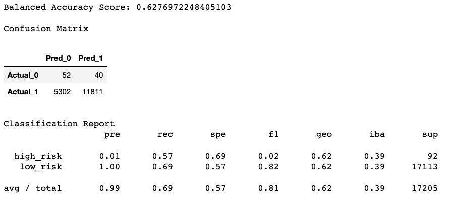
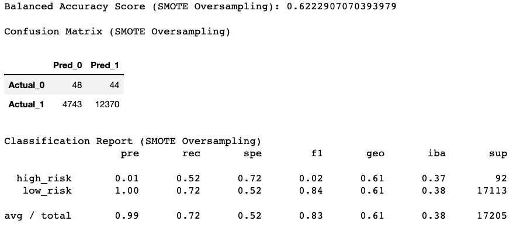
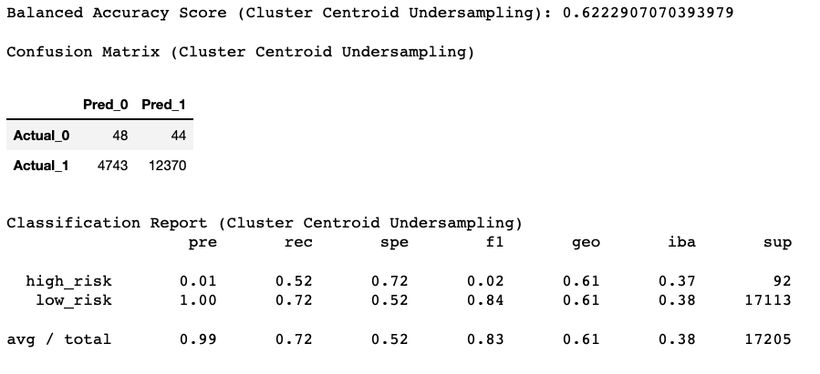
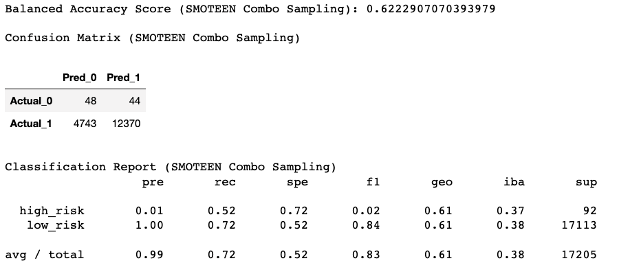
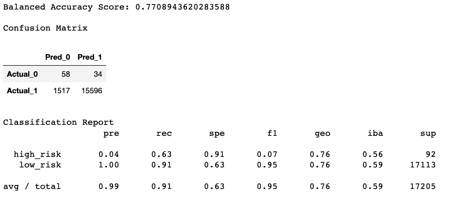
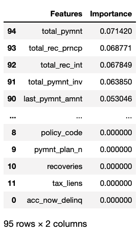
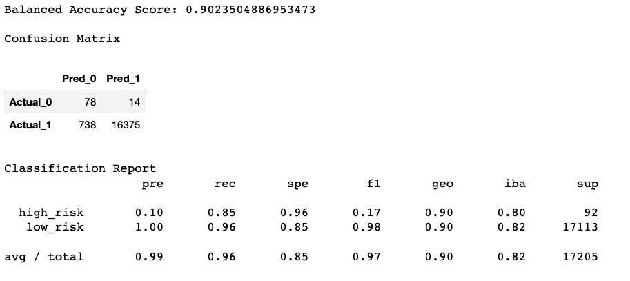

# Credit_Risk_Analysis
BC Mod 17

## Overview
The purpose of this analysis is to assess credit card risk by means of various machine learning models. Using a credit card dataset from LendingClub, there are below several models of machine learning in order to determine fraudulent charges. As credit card charge classifications, legitimate and fraudulent, present an inherently unbalanced classification problem, the models below account for this by various means of oversampling, undersampling, or a combined approach. The performance of each model is assessed. A recommendation can be found in the summary conclusion at the end of this report.  

### Resources
* Machine Learning Dev Environment
* Jupyter Notebook 6.4.6
* Python 3.7.11

Python Dependencies:
* numpy
* pandas
* Path from pathlib
* Counter from collections
* from sklearn.linear_model
  * LogisticRegression
* from sklearn.metrics
  * confusion_matrix
  * balanced_accuracy_score
* from sklearn.model_selection
  * train_test_split
* from imblearn.combine
  * SMOTEEN
* from imblearn.ensemble
  * BalancedRandomForestClassifier
  * EasyEnsembleClassifier
* from imblearn.metrics
  * classification_report_imblanced
* from imblearn.over_sampling
  * RandomOverSampler
  * SMOTE
* from sklearn.preprocessing
  * StandardScaler
* from imblearn.under_sampling
  * ClusterCentroids

## Results
Six models are described below. The set up for each model follows the same pattern describe in this section.  

After importing dependencies, the data is loaded and lightly cleaned.
```
# Load the data
file_path = Path('LoanStats_2019Q1.csv')
df = pd.read_csv(file_path, skiprows=1)[:-2]
df = df.loc[:, columns].copy()

# Drop the null columns where all values are null
df = df.dropna(axis='columns', how='all')

# Drop the null rows
df = df.dropna()

# Remove the `Issued` loan status
issued_mask = df['loan_status'] != 'Issued'
df = df.loc[issued_mask]

# convert interest rate to numerical
df['int_rate'] = df['int_rate'].str.replace('%', '')
df['int_rate'] = df['int_rate'].astype('float') / 100


# Convert the target column values to low_risk and high_risk based on their values
x = {'Current': 'low_risk'}   
df = df.replace(x)

x = dict.fromkeys(['Late (31-120 days)', 'Late (16-30 days)', 'Default', 'In Grace Period'], 'high_risk')    
df = df.replace(x)

df.reset_index(inplace=True, drop=True)

df.head()
```

The next process was to change variables with the object datatype into a numeric datatype.
```
# convert to df
df_types = pd.DataFrame(df.dtypes)
df_types.rename(columns = {0: "Dtype"}, inplace=True)
df_types.index = df_types.index.set_names(['Feature'])
df_types.reset_index()

# get df with only features having dtype 'object'
feature_strings = df_types[df_types['Dtype']=='object']

# get list of features that are objects
string_cols = feature_strings.index.values.tolist()

# remove loan_status from cols list
string_cols.remove('loan_status')

# create training variables by converting string values into numerical values using get_dummies()
df = pd.get_dummies(df, columns=string_cols)
df.head()
```

With a clean dataset, the features are selected into one variable (X), and the target into a second variable (y).
```
# Create our features
X = df.drop(columns='loan_status')

# Create our target
y = df['loan_status']
X.describe()
```

Next, the balance of the values are checked.
```
y.value_counts()
```

Finally, the dataset is divided into a training set and a testing set.
```
from sklearn.model_selection import train_test_split
X_train, X_test, y_train, y_test = train_test_split(X, y, random_state=12)
Counter(y_train)
```
This results in a majority set of 'low_risk', numbering 51,357, and 'high_risk', numbering 255.

### Model 1 - Naive Random Oversampling
This model balances the classification categories by oversampling the minority set. In this case, datapoints in the fraudulent classification are chosen at random and may be chosen more than once until the two classifications are balanced in equal numbers of cases. This is done in order to provide the machine learning algorithm the opportunity to see a sufficient number of fraudulent cases so that future data points may be accurately classified.  

In this case, the RandomOverSampler module from imblearn.over_sampling was used.  
```
# Resample the training data with the RandomOversampler
from imblearn.over_sampling import RandomOverSampler
ros = RandomOverSampler(random_state=12)
X_resampled, y_resampled = ros.fit_sample(X_train, y_train)
Counter(y_resampled)
```
The results were 51,357 data points in each classification set.  

The classification model was then trained using LogisticRegression from sklearn.linear_model.
```
# Train the Logistic Regression model using the resampled data
from sklearn.linear_model import LogisticRegression
model = LogisticRegression(solver='lbfgs', random_state=12)
model.fit(X_resampled, y_resampled)
```

Predictions were then created using the testing set, and a balanced accuracy score, a confusion matrix, and an imbalanced classification report were generated.
```
# Calculated the balanced accuracy score
from sklearn.metrics import confusion_matrix, balanced_accuracy_score
y_pred = model.predict(X_test)
bas = balanced_accuracy_score(y_test, y_pred)

# Display the confusion matrix
cm = confusion_matrix(y_test, y_pred)
cm_df = pd.DataFrame(cm, index=['Actual_0', 'Actual_1'], columns=['Pred_0', 'Pred_1'])

# Print the imbalanced classification report
from imblearn.metrics import classification_report_imbalanced
cri = classification_report_imbalanced(y_test, y_pred)
```
The results of which were as follows:  
  

### Model 2 - SMOTE Oversampling
The second model also utilizing oversampling. Data points from the minority set are oversampled by means of interpolating new data points from existing data points. Utilizing a number of close neighbors, new values are created and add to the sample set.  

After the resampling step shown below, the steps for the model's prediction and evaluation are the same as in Model 1.  
```
# Resample the training data with SMOTE
from imblearn.over_sampling import SMOTE
X_resampled, y_resampled = SMOTE(random_state=12,
                                 sampling_strategy='auto').fit_resample(X_train, y_train)
Counter(y_resampled)
```

The results of the SMOTE machine learning model evaluation were:  
  

### Model 3 - ClusterCentroids Undersampling
This model works by undersampling the majority set. The algorithm identifies clusters of the majority class, then generates synthetic data points, called centroids, that are representative of the clusters. The majority class is then undersampled dow to the size of the minority class.  

Again, the process of generating the evaluation is the same as in model 1, so we won't display the process here.  
```
# Resample the data using the ClusterCentroids resampler
from imblearn.under_sampling import ClusterCentroids
cc = ClusterCentroids(random_state=12)
X_resampled, y_resampled = cc.fit_resample(X_train, y_train)
Counter(y_resampled)
```
The results were 255 data points in each classification set.  

The results of the ClusterCentroids machine learning model evaluation were:  
  

### Model 4 - SMOTEENN Combination Sampling
This model combines the techniques of over and underssampling. The minority class is oversampled using the SMOTE technique discussed above. The majority calss is undersampled using the Edited Nearest Neighbor algorithm.  
```
# Resample the training data with SMOTEENN
from imblearn.combine import SMOTEENN
smote_enn = SMOTEENN(random_state=12)
X_resampled, y_resampled = smote_enn.fit_resample(X, y)
Counter(y_resampled)
```

The results of the SMOTEENN machine learning model evaluation were:  
  

### Model 5 - Balanced Random Forest Classifier
This model takes a different tack to the four models above. Rather than creating equal, or roughly equal, classification sets for the machine learning algorithm to learn, the Random Forest Classifier is an ensemble learning model in which multiple simple decision trees are combined to build a strong learning model.  

In addition to the process listed in the Results section above, the data need to be scaled for the purposes of the algorithm.
```
# import StandardScaler
from sklearn.preprocessing import StandardScaler

# create Standard Scaler instance
scaler = StandardScaler()

# fit the scaler
X_scaler = scaler.fit(X_train)

# scale data
X_train_scaled = X_scaler.transform(X_train)
X_test_scaled = X_scaler.transform(X_test)
```

The data is resampled and fit.
```
# Resample the training data with the BalancedRandomForestClassifier
from imblearn.ensemble import BalancedRandomForestClassifier
rf_classifier = BalancedRandomForestClassifier(n_estimators=100, random_state=12)

# fit the model
rf_classifier = rf_classifier.fit(X_train_scaled, y_train)
```

The process of prediction and evaluation is the same as the models above. The results of this algorithm are as follows:
  

An additional benefit to using the Random Forest model is that the features are evaluated for their influence upon the target.
```
# List the features sorted in descending order by feature importance
importances = sorted(zip(rf_classifier.feature_importances_, X.columns), reverse=False)
featured_scores = pd.DataFrame(importances, columns=['Importance', 'Features']).sort_values('Importance', ascending=False)
featured_scores = featured_scores[featured_scores.columns[::-1]]
featured_scores
```

  

From this list, the top five features are identified as: total_pymnt, total_rec_prncp, total_rec_int, total_pymnt_inv, and last_pymnt_amnt.

### Model 6 - Easy Ensemble AdaBoost Classifier
This model is a type of Adaptive Boosting algorithm that creates a model for the dataset and then evaluates the model. After evaluating the errors of the first model, another improved model is trained. This iterative process is repeated until completion.
```
# Train the EasyEnsembleClassifier
from imblearn.ensemble import EasyEnsembleClassifier
eec_classifier = EasyEnsembleClassifier(n_estimators=100, random_state=12)
eec_classifier = eec_classifier.fit(X_train_scaled, y_train)
```

The predictions and evaluation match the process above. The results of the evaluation are as follows:
  

## Summary
lorem ipsum
